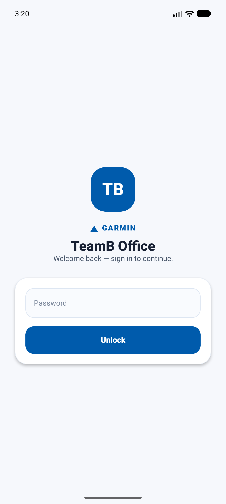
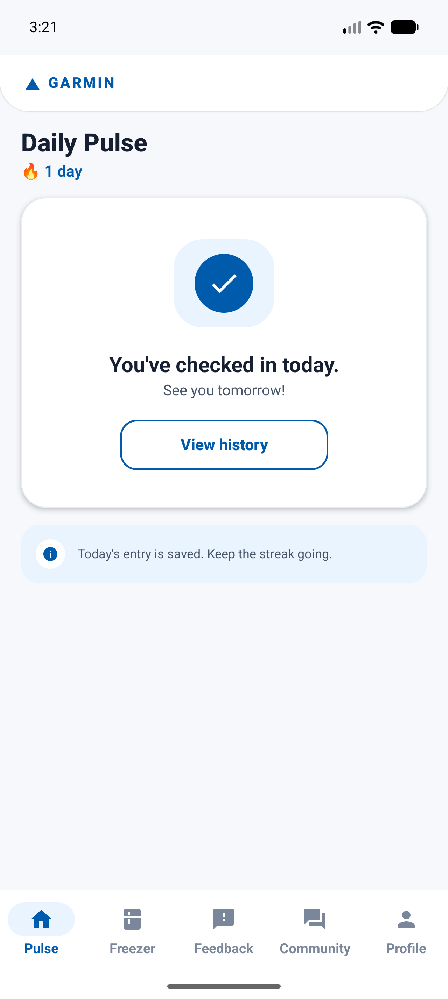
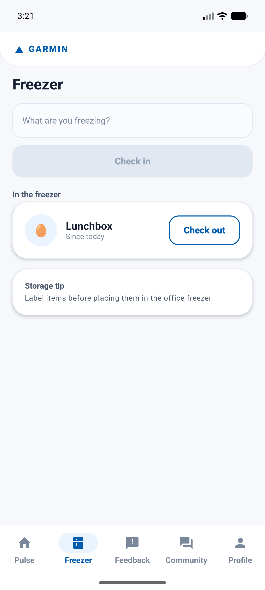
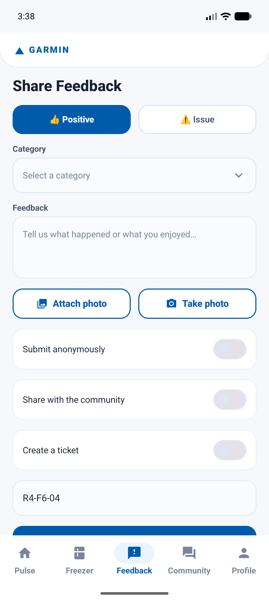
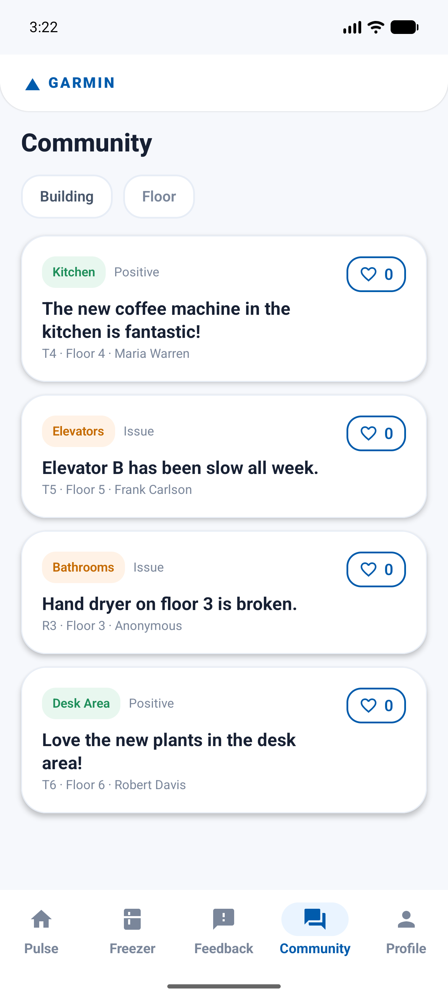
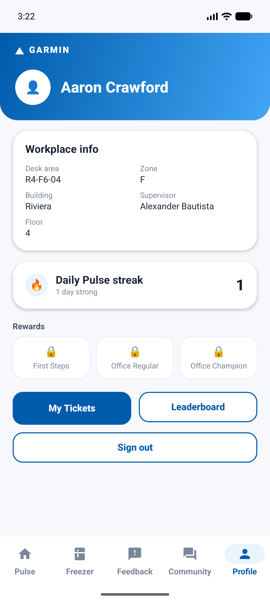
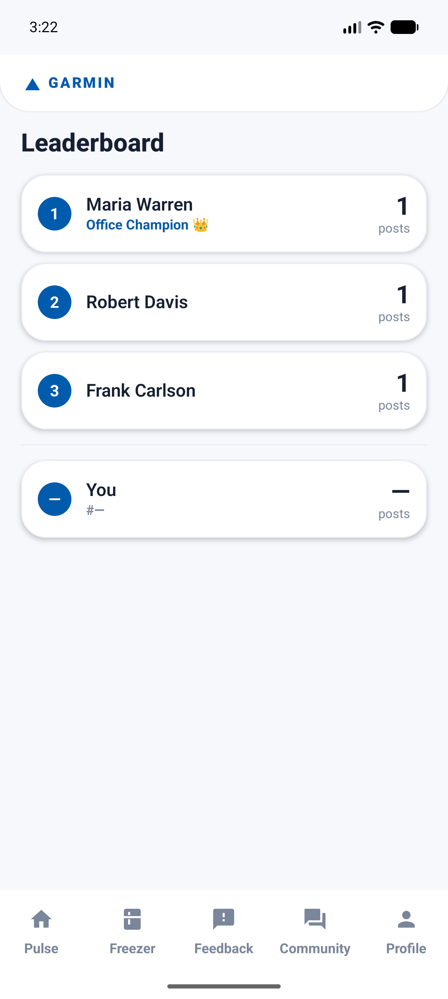

# TeamB Office

An Android app for a Garmin office that turns everyday workplace signal into action — a daily
"pulse" check-in, a shared freezer tracker, positive **and** issue feedback with on-device AI photo
categorization, facilities ticketing, a community newsfeed, and gamification (streaks, leaderboard,
rewards). Built with Kotlin + Jetpack Compose + Material 3.

## Screenshots

| Sign in | Daily Pulse | Freezer |
|---|---|---|
|  |  |  |

| Share Feedback | Community | Profile |
|---|---|---|
|  |  |  |

| Leaderboard |
|---|
|  |

## Features

- **Onboarding & login** — pick your identity from a searchable directory (loaded from the desk
  allocation dataset), set a local password, sign out / unlock on return.
- **Daily Pulse** — quick mood check-in with streaks and daily reminder notifications.
- **Freezer** — check food in/out of the shared freezer with smart cleanup reminders.
- **Share Feedback** — positive or issue feedback with categories, photos, and **on-device AI photo
  categorization** (ML Kit) that drafts the issue/category for you; anonymous or public; optional
  community visibility.
- **Ticketing** — actionable feedback can raise a facilities ticket (email to #CLU-Facilities or a
  mock Jira ticket); positive feedback never creates one; track status in "My Tickets".
- **Community newsfeed** — browse shared feedback, vote, and filter by building/floor.
- **Gamification** — Daily Pulse streaks, a leaderboard ("Office Champion"), and rewards.

## Privacy

User identities never leave the device. Community records are linked only by an opaque user id;
display names are resolved locally from the bundled (anonymized) directory. Anonymous submissions
carry no identity at all.

## Architecture

MVVM + repositories with mockable integration interfaces (directory, ticket router, AI photo
detector, community store). Local persistence via Room + DataStore; passwords stored as a salted
hash. The community surface runs on a seeded in-memory store by default, with a Firebase Realtime
Database implementation ready to enable once a `google-services.json` is supplied.

```
app/src/main/java/com/example/teamb/
  AppContainer.kt              # manual DI
  data/ (db, datastore, desk, integration, community, repository, model, util)
  notification/                # WorkManager reminders + notifications
  ui/ (theme, components, navigation, <feature> screens + ViewModels)
```

## Build & run

Requires **JDK 17–21** (AGP 8.7 does not support JDK 25):

```sh
export ANDROID_HOME="$HOME/Library/Android/sdk"
export JAVA_HOME="$(/usr/libexec/java_home -v 21)"   # or Android Studio's bundled JBR

./gradlew assembleDebug                 # build debug APK
./gradlew installDebug                  # install on a connected device/emulator
./gradlew jacocoCoverageVerification    # run unit tests + 90% coverage gate
```

Or open the project in Android Studio and run the `app` configuration.

## Quality

~136 unit tests; JaCoCo enforces a 90% line-coverage gate on the testable logic (UI, DI, and
platform-bound integration are excluded from the denominator).
