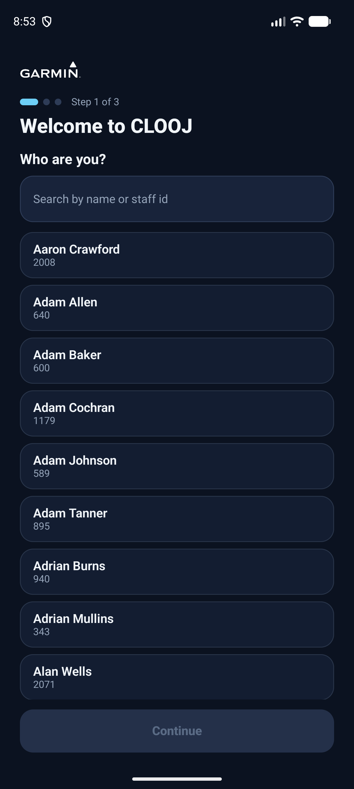
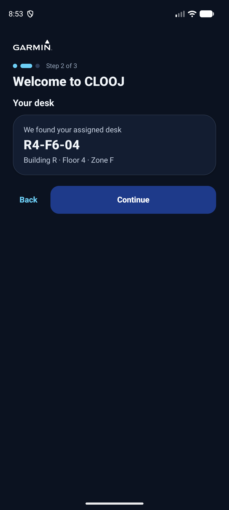
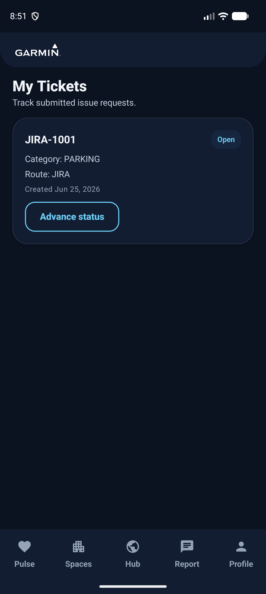

# CLOOJ — Cluj Location Office Optimization Journey

A workplace-feedback Android app for the Garmin **Cluj** office: a daily mood "pulse",
shared kitchen/fridge tracking, positive **and** issue feedback with on-device AI photo
categorization, facilities ticketing, and a community newsfeed with photos and voting.
Built with Kotlin + Jetpack Compose + Material 3.

## Screenshots

| Onboarding | Your desk | Daily Pulse |
|---|---|---|
|  |  |  |

| Hub | Spaces | Kitchen |
|---|---|---|
|  |  |  |

| Report | Feedback | Profile |
|---|---|---|
|  |  |  |

| Leaderboard | My Tickets | |
|---|---|---|
|  |  | |

## Features

- **Onboarding & auto-login** — pick your identity from a searchable directory, auto-detect your desk,
  set a local password. The session is **remembered** (auto-login on relaunch); **sign out** clears it.
- **Daily Pulse** — one-tap mood check-in with a rolling 7-day trend graph, streaks, and reminders.
- **Spaces & Kitchen** — live per-floor shared-fridge occupancy (synced across devices), office-freezer
  check-in/out, a Kitchen Pulse that reflects real fridge fullness, and quick-report shortcuts that
  open the feedback form pre-filled.
- **Report & Feedback** — positive or issue feedback with categories, photos, and **on-device AI photo
  categorization** (ML Kit); anonymous or public; optional facilities ticket (mock Jira / email) —
  positive feedback never raises one. Submitting returns you instantly with a confirmation toast.
- **Hub (community newsfeed)** — shared feedback with voting, Building/Floor filters, and **attached photos**
  shown inline with a **full-screen viewer**.
- **Profile & Gamification** — streaks, rewards, a leaderboard ("Office Champion"), and a
  light/dark/system appearance toggle. Skeleton loaders keep cloud-backed screens responsive.

## Privacy

User identities never leave the device. Community records — including any attached photo — are linked
**only by an opaque Staff ID plus content**; display names are resolved locally from the bundled
(anonymized) directory. Anonymous submissions carry no identity at all.

## Architecture

MVVM + repositories behind mockable integration interfaces (directory, ticket router, AI photo
detector, photo encoder, community store). Local data uses Room + DataStore; passwords are a salted
hash in encrypted storage. The shared surfaces — community newsfeed/votes, fridge occupancy, and pulse
— run on **Firebase Realtime Database** (project `clooj-ggg`); everything else stays on-device. Photos
are downscaled, JPEG-compressed and base64-encoded before being stored in the feed (no Firebase Storage
needed). Firebase config is committed (`app/google-services.json`) and the RTDB security rules live in
[`database.rules.json`](database.rules.json).

```
app/src/main/java/com/example/teamb/
  AppContainer.kt              # manual DI
  data/ (db, datastore, desk, integration, community, sync, repository, model, util)
  notification/                # WorkManager reminders + notifications
  ui/ (theme, components, navigation, <feature> screens + ViewModels)
```

## Build & run

Requires **JDK 17–21** (AGP 8.7 does not support newer JDKs):

```sh
export JAVA_HOME="$(/usr/libexec/java_home -v 21)"   # or Android Studio's bundled JBR

./gradlew assembleDebug                 # build debug APK
./gradlew installDebug                  # install on a connected device/emulator
./gradlew jacocoCoverageVerification    # run unit tests + 90% coverage gate
```

> Run `assembleDebug` and the `jacoco*` tasks as **separate** Gradle invocations.

## Quality

174 unit tests; JaCoCo enforces a **90% line-coverage gate** on testable logic (≈97% line / 92%
instruction; pure UI, DI and platform-bound integrations are excluded from the denominator).

## Documentation

- **[App walkthrough](docs/app-walkthrough.md)** — a guided tour / demo script of every screen.
- **[QA test cases](docs/qa-test-cases.md)** — manual test cases (with priorities) for QA.
- **[Test & feature report](docs/test-and-feature-report.md)** — current test results and feature status.
