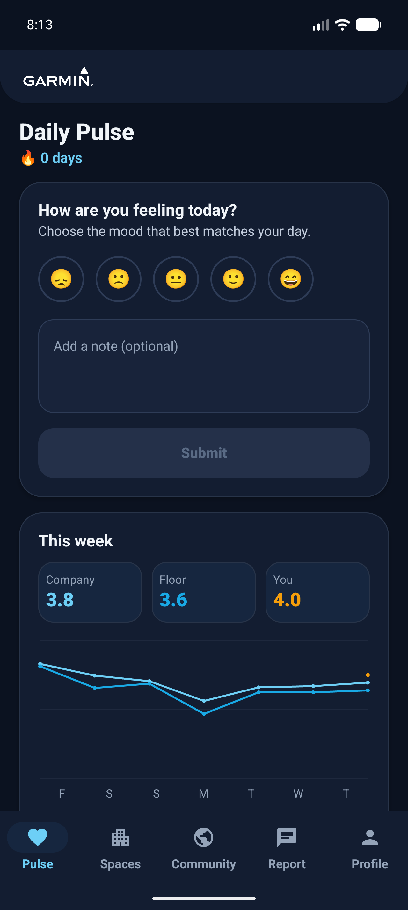
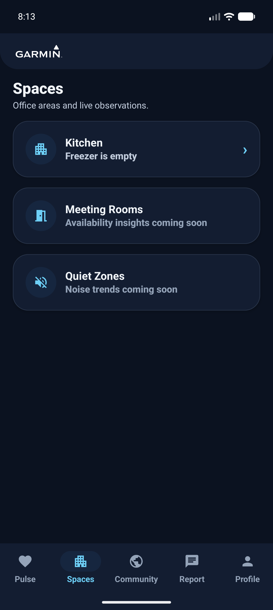
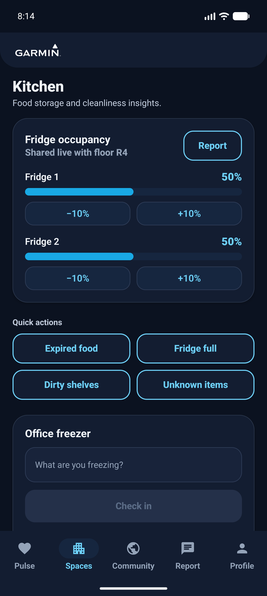
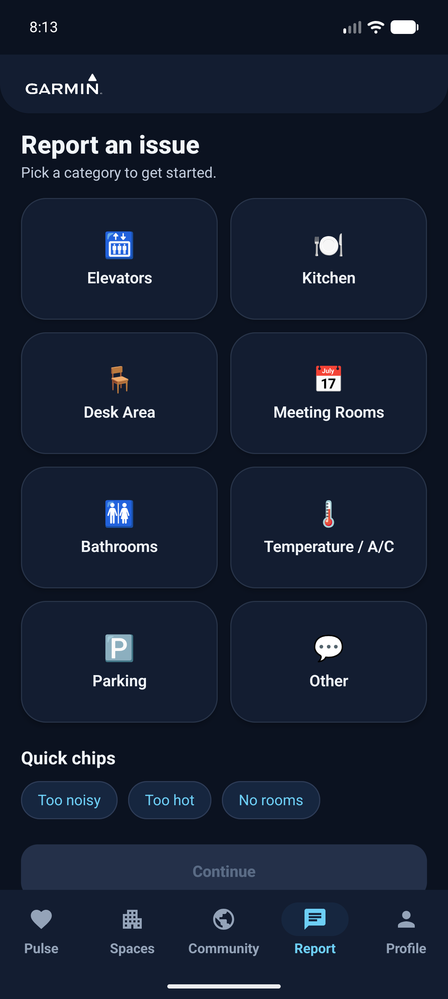

# CLOOJ — App Walkthrough

A guided tour of CLOOJ, the workplace-feedback app for the Garmin **Cluj ("CLOOJ")** office.
Use this as a demo script or a hand-off overview for stakeholders. Screenshots are dark mode.

---

## At a glance

CLOOJ turns everyday workplace signal into action. Employees check in their mood, track the shared
kitchen, raise positive or issue feedback (with photos and on-device AI categorization), and see what
the office is saying — all while **personal identities stay on the device** and only anonymized,
content-only records reach the cloud.

**Five tabs:** Pulse · Spaces · **Community** (center) · Report · Profile.

---

## 1. Getting in — onboarding & auto-login

1. **Who are you?** Search the office directory and pick yourself.
2. **Your desk** is auto-detected from the desk-allocation dataset (building, floor, zone) — no manual
   entry needed.
3. **Create a password.** That's it — you go straight into the app.

After the first time, CLOOJ **remembers your session**: opening the app logs you in automatically.
**Sign out** (in Profile) fully clears the local identity and the remembered session, returning you to
onboarding.

## 2. Daily Pulse

A one-tap mood check-in (once per day) with an optional note. The screen shows your **streak** and a
**rolling 7-day trend graph** comparing **You** (orange), your **Floor** (cyan) and the **Company**
(sky), plus this week's averages. While data loads, animated **skeleton placeholders** keep the screen
feeling responsive.

## 3. Spaces & Kitchen

 

**Spaces** lists office areas. **Kitchen** is the rich one:

- **Shared fridges** — two per floor, with **live occupancy synced across devices**; adjust with
  ±10% controls.
- **Office freezer** — personal check-in/out of items you store, with a "since" date.
- **Kitchen Pulse** — a status line that **reflects real fridge fullness** (e.g. "Fridge full" when
  fridges are ≥80%, "No major issues" when they're empty).
- **Quick actions & fridge Report** — shortcuts that open the feedback form **pre-filled** (e.g.
  "The fridges on floor 4 of the Riviera building are currently about 50% full.") and set to share
  with the community, so reporting takes one tap plus a quick edit.

## 4. Report & Feedback

Reporting starts from a **category grid** or one-tap **quick chips** (Too noisy / Too hot / No rooms)
that pre-fill the form. The feedback form supports:

- **Positive 👍 or Issue ⚠️** feedback.
- **Photos** — attach from the gallery or camera. An **on-device AI** (ML Kit) suggests an issue label
  and category (always optional, never blocks submitting).
- **Toggles** — submit anonymously, share with the community, and/or raise a facilities ticket.
- **Ticketing** — issues can route to a (mock) Jira ticket or a #CLU-Facilities email; **positive
  feedback never raises a ticket**. Track everything in **My Tickets**.

After submitting, a confirmation toast appears and the form **returns you instantly** to where you came
from.

## 5. Community

The shared newsfeed — "What's happening around CLOOJ." Browse posts (newest first), **vote** with the
heart, and **filter by Building / Floor** using clear dropdown chips (Floor stays disabled until you
pick a Building). Posts with **photos show them inline**, and **tapping a photo opens it full-screen**.
Names are resolved **locally** from the bundled directory — anonymous posts simply show "Anonymous".

## 6. Profile & Gamification

Your workplace card (desk, building, floor, supervisor), **Daily Pulse streak**, and **Rewards**
(First Steps → Office Regular → Office Champion). An **Appearance** toggle switches Light / Dark /
System, and the **Leaderboard** ranks contributors by **public** feedback, crowning an **Office
Champion 👑** (anonymous posts don't count). Sign out lives here too.

---

## Privacy in one paragraph

User identities never leave the device. Records written to the cloud (Firebase Realtime Database) are
linked **only by Staff ID plus content** (category, sentiment, location, votes, occupancy, and a
no-PII photo) — never names, emails or supervisors. Anonymous submissions carry no identity. Display
names are resolved on each device from the bundled, anonymized desk-allocation dataset.

## Tech, in one line

Kotlin + Jetpack Compose + Material 3, MVVM with repositories and mockable integrations; Room +
DataStore on-device, Firebase Realtime Database for the shared surfaces (community, fridges, pulse).
